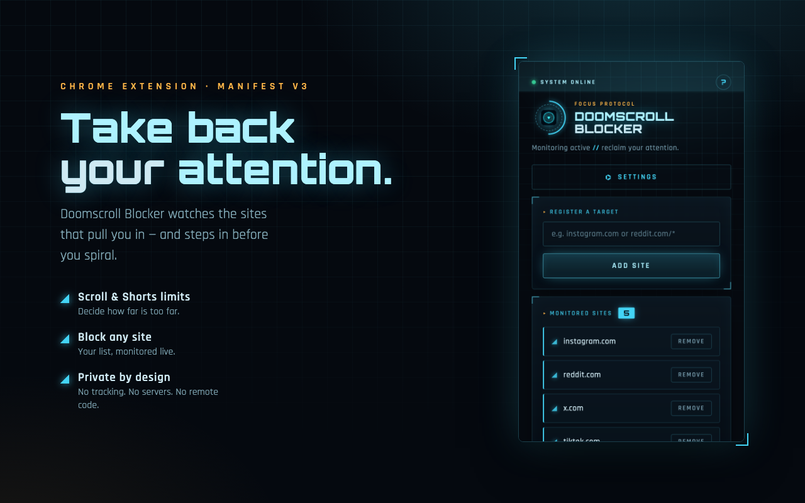
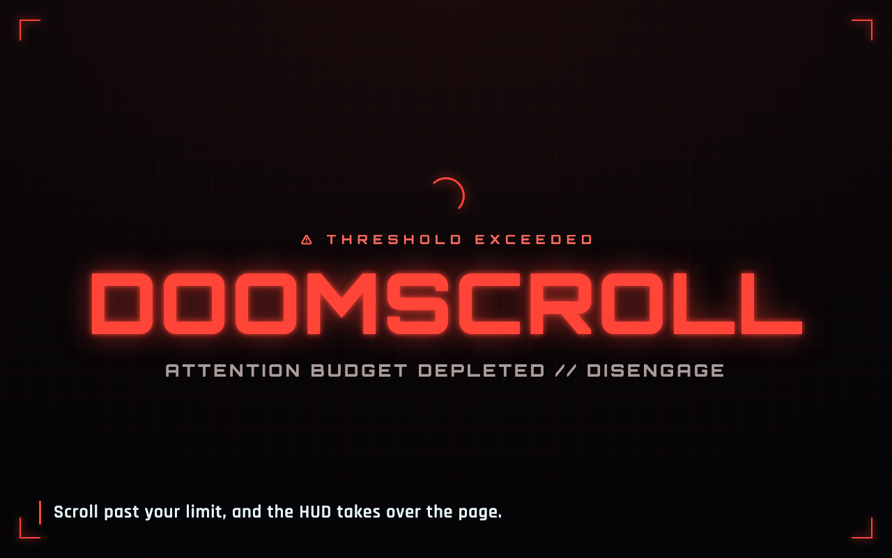
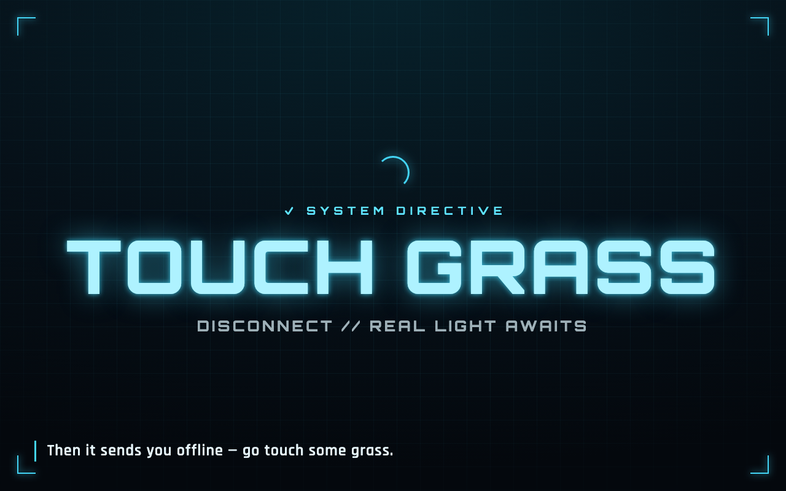

<h1> Doomscroll Blocker</h1>

> A Chrome extension that stops the spiral and helps you go touch grass — now with an Iron Man–inspired HUD.

## Features

- **Scroll & Shorts limits** — warns you once you scroll too far on a site, or watch too many YouTube Shorts.
- **Block any site** — keep your own monitored list; defaults include the usual time-sinks.
- **Live settings** — changes apply to open tabs instantly, no reload needed.
- **Heads-up intervention** — a full-screen alert that fades the page out, then sends you off to touch grass.
- **Private by design** — only the `storage` permission, no tracking, no servers, no remote code, self-hosted fonts.

## Screenshots

<p align="center">
  <br>
  
  
</p>

## Development

Built with **TypeScript** + **esbuild** (no framework).

```bash
pnpm install
pnpm build       # typecheck, bundle to build/, and zip to dist/build.zip
pnpm watch       # rebuild on change (reload the unpacked extension manually)
pnpm typecheck   # tsc --noEmit
```

Load the unpacked extension from `build/` via `chrome://extensions` (Developer mode → Load unpacked).

- `src/` — TypeScript sources (`popup`, `contentScript`, `background`, plus shared `constants` / `types` / `warning`).
- `public/` — static assets (`manifest.json`, `popup.html`, `fonts.css`, fonts, icons) copied verbatim to `build/`.
- `scripts/build.mjs` — the esbuild build (3 entries → classic IIFE bundles).

## Changelog

### 1.0.2

- Fix the in-page warning overlay collapsing into a squished vertical column on sites with aggressive global text-wrapping CSS (e.g. Reddit, YouTube).

### 1.0.1

- Refined the app icon to a circular arc-reactor badge (transparent corners).
- Refreshed Chrome Web Store assets (icon, promo tiles) and added listing copy.

### 1.0.0

- **Complete visual redesign** into a dark, Iron Man–style HUD: arc-reactor logo, holographic grid, neon-cyan controls, and a full-screen "threshold exceeded" alert that resolves into a calm "touch grass" directive.
- **Rewritten in TypeScript** with strict type-checking.
- **New build system** — replaced webpack with esbuild (sub-100ms builds, one dev dependency).
- **Hardened for 2026 MV3 best practices:**
  - Fixed a URL-matching bug where a blocked domain could match unrelated sites (now parses the hostname with subdomain awareness).
  - Dropped the `tabs` permission — the extension now requests only `storage`.
  - Content script self-initializes and reacts to setting changes live via `storage.onChanged` (no page reload).
  - YouTube Shorts detection now uses the Navigation API (with a fallback).
  - Self-hosted fonts (no third-party network requests) and an explicit Content Security Policy.
- New arc-reactor app icon.

### 0.4.1

- Added a settings card so you can save custom scroll distance and YouTube Shorts limits.
- Slowed down the warning flash.

### 0.4.0

- Added support for YouTube Shorts blocking!
- Added a help button
- Various bug fixes and improvements

### 0.3.3

- Allow specifying subdomains

### 0.3.2

- Name update
- Description update

### 0.3.1

- UI Improvements.

### 0.3.0

- Major bug fixes involving blocked sites not working on install.
- User Experience Improvements.
- Upgraded vulnerable dependencies.

### 0.2.1

- Minor bug fixes.

### 0.2.0

- Major UI/UX Improvements.

### 0.1.0

- Initial release!

## Install

[**Chrome** extension](https://chrome.google.com/webstore/detail/doomscroll-blocker/gneldbncofioemhoaifgeneiadeodgmh?hl=en&authuser=0)

## Contribution

Suggestions and pull requests are welcomed!

https://github.com/jasonzh0/doomscroll-blocker
